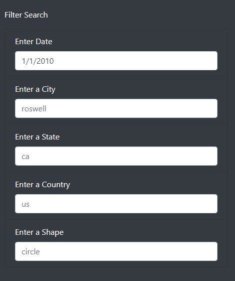

# UFOs

## Overview

The purpose of this analysis was to create a dynamic webpage to filter through a javascript file containing UFO sighting reports from different U.S cities.

## Results:

The data can be filtered by date, city, state, coutry, and shape.
Each parameter can be filtered individually or as a combination.\

## Summary:
- A drawback of this webpage is that it's not clear which dates are available to parse.
- The date label could be edited to note that this table only contains data from 1/1/2010 - 1/13/2010.
- Another recommended modication would be removing the country filter since all of the data pertains to cities and states within the United States.
- One last improvement would be to add a list or menu for the user to see which cities and states are available to filter.

Overall this webpage provides a simple interface for filtering through the provided javascript file and can be expanded with more data to draw conclusions about UFO sightings.
